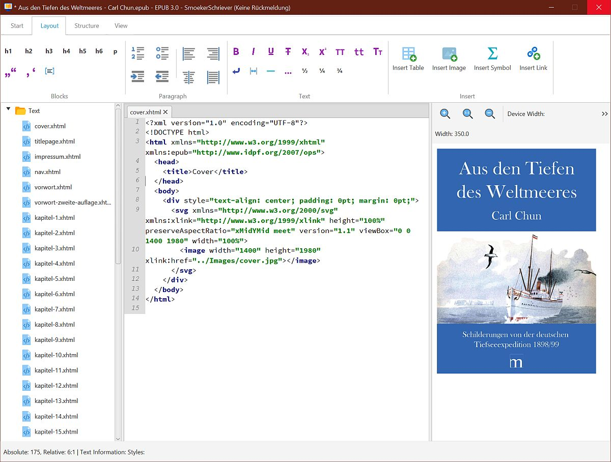
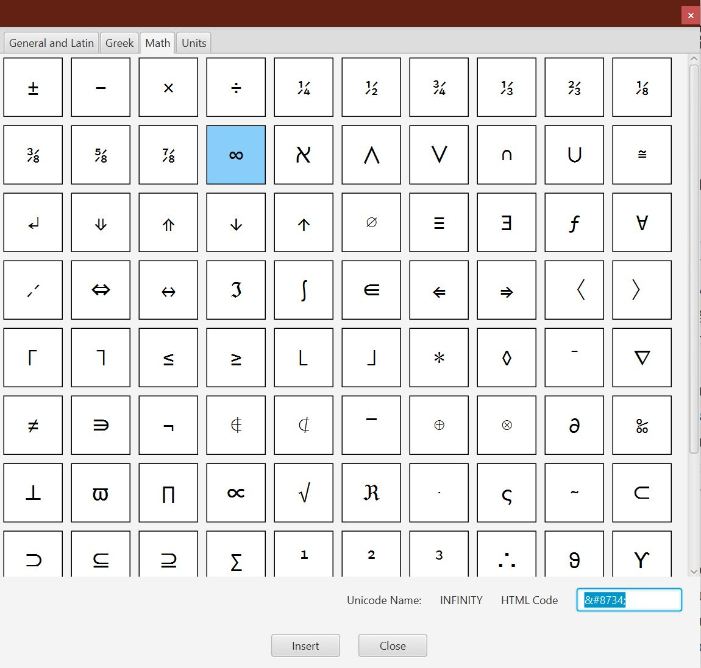

# SmoekerSchriever - EpubFx
## General
SmoekerSchriever (lower german for _book writer_) is an epub editor written in JavaFX.

The layout and the functionality of this application is inspired by the famous editor Sigil. But i want added some more convenient functions for easier and more user friendly epub editing. 

The editor supports ebooks in epub 2 and epub 3 format. 

## Functions
### Current features
This project is in early stage, but some functions are working (with possible bugs):

- book browser
- Creating of ebooks by free configurable templates (put only a epub file into a folder, the system find it and the user can choose this epub as template)
- HTML editor with syntax highlighting and undo/redo
- CSS editor with syntax highlighting and undo/redo
- auto completion of [, {, ( and " with the second part of it
- spell check
- Applying text snippets and text snippets editor  
- inserting images and other media into book using configurable templates 
- inserting tables using configurable templates
- inserting links to internal and external targets
- Preview of xhtml file
- preview of image files with information about size and dimension  
- basic search function (currently working: search and replace in current file, search in current file, all files, all html files (only forward searching available))
- generating and editing toc ncx (epub 2) and nav (epub 3)
- generating cover file by image 
- if nav for epub 3 is generated a ncx file can be generated for backwards compatibility 
- creating cover xhtml file by image
- splitting files
- sorting files by drag and drop in book browser
- renaming files
- setting title of all xhtml files
- check of ebook with official epub checker (not configurable yet)
- opening files in external applications (for example to edit images), currently only configurable by editing configuration file directly
- insert special symbols via dialog (typographical signs, special latin chracters, greek alphabet, mathematical symbols, measurement unit signs)

### Planned feature:
- configuration for external applications
- checking internal and external links
- functions to improve the ebook

## Build and Running

*SmoekerSchriever - epubfx* needs Java 11 or higher to run. The application is build by maven. Currently you can the application only running in an ide (like eclipse, intellij) by starting the `EpubEditorStarter` class. 

I plan to include the maven javafx plugin for easier running the app.  

## Usage
### General Keys
- CTRL-S: saves the ebook
- CTRL-F: opens the search panel
- CTRL-O: opens an ebook

### In book browser
#### Keys 
- CTRL-C on file item in tree: copy the file name
- CTRL-A: select all items
- F2: rename file
- DEL: delete file

#### Mouse
- double click: open file in editor (css, xml, xhtml)
- right (secondary button) click: open context menu  

### Editor 
#### Keys 
- DEL: delete forward
- BACKSPACE: delete back
- RETURN, ENTER: insert paragraph (not html paragraph `

`)
- TAB: insert tab or spaces (configurable how much spaces or tab character is used)
- CTRL-1: change current paragraph to headline level 1  (`<h1></h1>`) 
- CTRL-2: change current paragraph to headline level 2  (`<h2></h2>`)
- CTRL-3: change current paragraph to headline level 3  (`<h3></h3>`)
- CTRL-4: change current paragraph to headline level 4  (`<h4></h4>`)
- CTRL-5: change current paragraph to headline level 5  (`<h5></h5>`)
- CTRL-6: change current paragraph to headline level 6  (`<h6></h6>`)
- CTRL-SHIFT-P: change current non-paragraph to paragraph  (`

`)
- CTRL-DEL: delete next word
- CTRL-BACKSPACE: delete previous word
- CTRL-I: wrap selected text with i-tag `<i></i>`
- CTRL-C: copy selection 
- CTRL-X: cut out selection
- CTRL-Y: paste
- CTRL-Z: undo
- CTRL-SHIFT-Z, CTRL-Y: redo
- CTRL-SHIFT-S: split file on cursor position

Tabs:
- ALT-RIGHT: next tab
- ALT-RIGHT: previous tab 

#### Mouse
- double click: select word
- triple click: select paragraph  
- SHIFT-Click: Select text from current caret position to mouse click position
- right (secondary button) click: open context menu

## Credits
The following software and frameworks are used in *SmoekerSchriever - epubfx*:
* Application icon: Icons made by <a href="https://www.flaticon.com/authors/freepik" title="Freepik">Freepik</a> from <a href="https://www.flaticon.com/" title="Flaticon">www.flaticon.com</a>
* Icons by [Icons8](https://icons8.com)
* [RibbonFx](https://pixelduke.com/fxribbon/) as ui component 
* [languagetool](http://languagetool.org) for spell checking
* [htmlcleaner](https://sourceforge.net/projects/htmlcleaner/) for repair and importing (x)html files
* [PreferencesFX](https://github.com/dlsc-software-consulting-gmbh/PreferencesFX) for editing, storing and loading preferences
* [RichTextFx](https://github.com/FXMisc/RichTextFX) for code editing  
* [ControlsFx](https://github.com/controlsfx/controlsfx) for some ui components
* [JDOM 2](http://jdom.org/) for parsing and output xml
* [Blitz ebook framework](https://github.com/FriendsOfEpub/Blitz) generated css as part of templates, in future maybe support for creating book specific css per blitz and less compiler 

